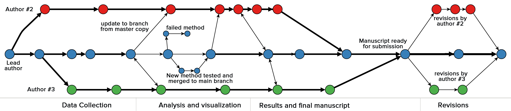

---
title       : Reproducible research
subtitle    : Few concepts and a couple of tools
author      : Joona Lehtomäki
job         : 
framework   : io2012        # {io2012, html5slides, shower, dzslides, ...}
highlighter : highlight.js  # {highlight.js, prettify, highlight}
hitheme     : tomorrow      # 
widgets     : []            # {mathjax, quiz, bootstrap}
mode        : selfcontained # {standalone, draft}

--- #content &vcenter

## Content

 1. Background
 2. Concepts
 3. Tools: RStudio and Git

--- #motivation1 bg:url(assets/img/motivation_composite.png) bg-repeat:no-repeat bg-position:center

## My own PhD

--- #open-science &twocol w1:50% w2:50%

## Open science

"Opening up access to the data and software, not just the final publication, is one of goals of the open science movement" <br />(Ram, 2013)

*** left
- Open access
- Open data
- Open notebook science
- Open source software

*** right

</img>

--- &notitle bg:black

</img>

--- #concepts

## Reproducibility

> * With replication, independent investigators address a scientific hypothesis and build up evidence for or against it (Peng, 2011)
> * Allows others to build upon existing work and use it to test new ideas and develop methods (Ram, 2013)
> * While currently there is unilateral emphasis on "first" discoveries, there should be as much emphasis on replication of discoveries (Ioannidis, 2005)

--- #problems1 

</img>

Wolkovich et al. 2012

--- #problems2

</img>

Peng 2011

--- #problems5

</img>

Sirkiä et al. 2012

--- #problems6

<iframe src="http://bit.ly/10FnSHI"></iframe>

--- #rstudio1

## Tools for reproducible research

<br />

</img>

--- #rstudio2 bg:url(assets/img/rstudio_analysis.png) bg-repeat:no-repeat bg-position:center

--- #rstudio3

## Reproducible?

> * Automatically regenerate documents when code, data, or assumptions change
> * Eliminate transposition errors that occur when copying results into documents
> * Preserve contextual narrative about why analysis was performed in a certain fashion
> * Documentation for the analytic and computational processes from which conclusions are drawn

Xie, 2012

--- #rstudio4 &notitle

<br />
<br />

</img>

--- #rstudio5 bg:url(assets/img/rstudio_knitr_input.png) bg-repeat:no-repeat bg-position:center

--- #rstudio6 bg:url(assets/img/rstudio_knitr_output.png) bg-repeat:no-repeat bg-position:center

--- #rstudio7 bg:url(assets/img/knitr_workflow.png) bg-repeat:no-repeat bg-position:center

<span style="position: fixed; bottom: 100px;">
Adapted from Markus Kainu
</span>

--- #rstudio8

## More R-code

```{r}
# Quick summary
library(ggplot2)
summary(cars)
```
--- #rstudio8 &notitle

```{r, echo=TRUE,message=FALSE}
# Quick plot of the data
qplot(speed, dist, data=cars) + geom_smooth()
```

--- #rstudio9 &vcenter

[**source**](http://bit.ly/Y8y8uO)


--- #git1

## Tools for reproducible research

<br />

</img>

--- #git2 bg:url(assets/img/github_linux.png) bg-repeat:no-repeat bg-position:center

--- #git3 bg:url(assets/img/github_landing_page.png) bg-repeat:no-repeat bg-position:center

--- #git4

## What is git? #

<br />


* It stores snapshots of your projects
* ...It also stores the relationships between those snapshots

--- #git5 &image

</img>

--- #git6

## Why use git in science?

> 1. Lab notebook
> 2. Facilitating collaboration
> 3. Backup and failsafe against data loss
> 4. Freedom to explore new ideas and methods
> 5. Mechanism to solicit feedback and reviews
> 6. Increase transparency and verifiability
> 7. Managing large data
> 8. Lowering barriers to reuse

--- #git7 &image

<br />
<br />

</img>

<br />

Ram (2013)

--- #git8

## Git: steep learning curve?

</img>

--- #git9

</img>

--- #git10

</img>

--- #git11 bg:url(assets/img/rstudio_git_history.png) bg-repeat:no-repeat bg-position:center


--- #reference

### Reference:
<div class="reference">
[1] Ram K. (2013): Git can facilitate greater reproducibility and increased transparency in science. Source Code for Biology and Medicine [Internet]. [cited 2013 Mar 1];8(1):7. Available from: http://www.scfbm.org/content/8/1/7.
</div>